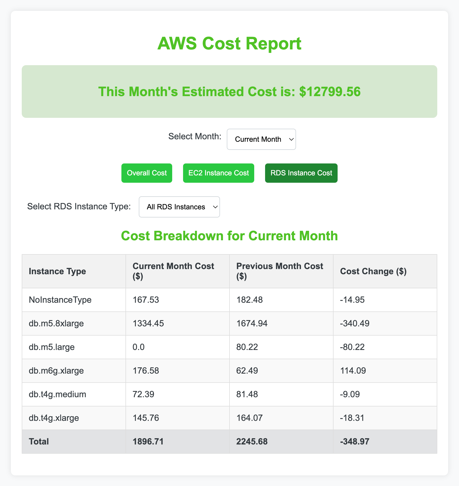
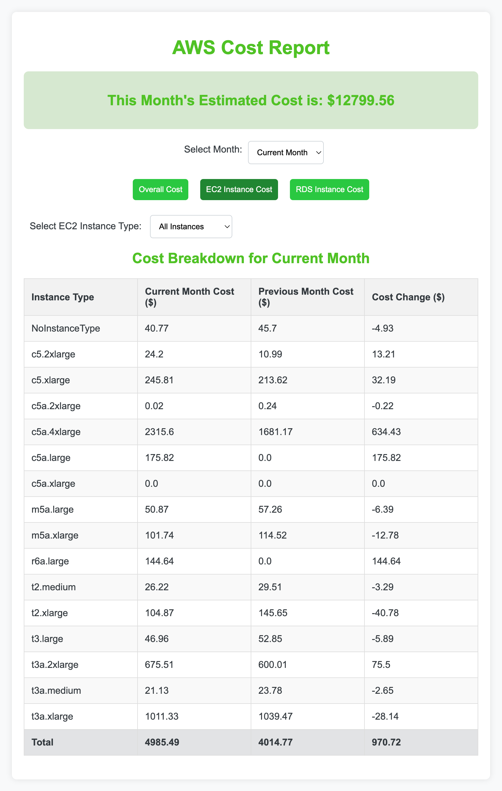

### Running the AWS Cost Comparison Code
This applicatin creates a dashboard for aws cost comparison for last 24 months. It has a overall cost comparison which compares cost of  each services used in aws with pervious months shows whether we are paying more or less. Negative value in cost difference means we are paying less and postive is more. 

Also we can see each EC2 instances cost , RDS instances cost and compare them with previous months.

### Screenshots of App

## Overall Cost


## RDS Cost



## EC2 Cost


<Image src="./SS/ec2.png" alt="EC2 Cost" />

#### Prerequisites

- Python version 3.10 or higher installed on your host.
- Ensure `pip` is installed for Python package management.
- AWS credentials configured on the host with access to Cost Explorer.
- AWS credentials that have access to AWS CE

### IAM Policy Required for AWS user to run this script

Create a user in aws and assign following IAM permission to that user.

          {
              "Version": "2012-10-17",
              "Statement": [
                  {
                      "Effect": "Allow",
                      "Action": [
                          "ce:GetCostForecast",
                          "ce:GetCostAndUsage"
                      ],
                      "Resource": "*"
                  }
              ]
          }
          
          
#### Setup Instructions on Local

1. **Clone the Repository:**
   ```bash
   git clone https://github.com/janamkhatiwada/aws_cost_explorer.git 
   cd aws_cost_explorer
   ```

2. **Install Dependencies:**
   ```bash
   pip install -r requirements.txt
   ```

3. **Run the Cost report generator:**
   Execute the Python script (`cost.py`) to generate the AWS cost comparison report:
   ```bash
   python cost.py
   ```

4. **Run the Application:**
   Execute the Python script (`app.py`):
   ```bash
   python app.py
   ```

Default Username: ```admin```
Default Password : ```password```

## Running Docker Image
   ```bash
   docker build --build-arg AWS_ACCESS_KEY_ID=your_aws_access_key \
             --build-arg AWS_SECRET_ACCESS_KEY=your_aws_sec_key \
             --build-arg AWS_REGION=eu-central-1 \
             -t test-app -f Dockerfile .

   ```

```bash
   docker run -it -p 5000:5000 test-app
```
Open http://localhost:5000 and you will see the Cost Comparision.

## Deploying in Kubernetes
You can create a pipeline in Github/Gitlab/Jenkins to build image and deploy that image to Kubernetes. Manifests are available on Kube Folder.

#### Automating with GitHub Actions

To automate daily updates and receive alerts at the end of each month, utilize the provided GitHub Actions workflow (`cost-report.yml`). This workflow ensures your cost reports are always up-to-date and notifies you when a new month begins.

For detailed setup and customization of the GitHub Actions workflow, refer to the `cost-report.yml` file in .github/workflows.

---
